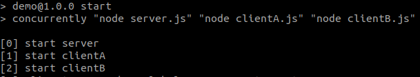
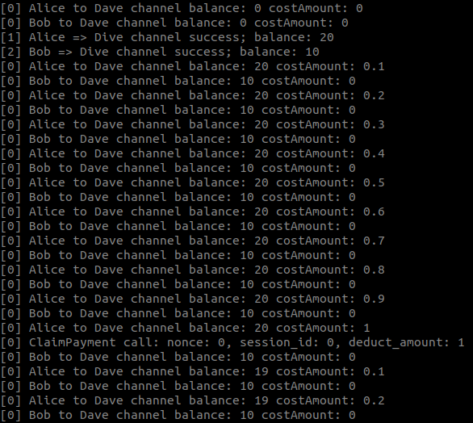
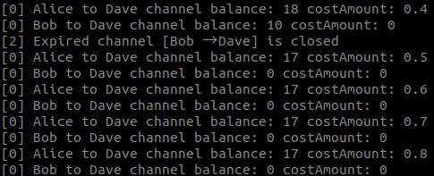

# Micropayment Library Workshop  
## 1.Introduction  
The Micropayment pallet provides functionality for Deeper Connect devices to open/close micorpayment channels and for servicing device to claim micropayments from the channel.

The Micropayment pallet provides the following functions:

For client
- Open a micropayment channel
- Add balance to the existing channel
- Close an expired channel
- Close all the expired channels

For server
- Close a micropayment channel
- Claim payment from the micropayment channel

## 2.Basic requirements before starting
You should have completed at least the following three steps before attempting this tutorial:

- [Rust local environment configuration](https://github.com/AmadeusGB/orml-workshop/blob/main/rust-setup.md)  
- [deeper chain node environment configuration](https://github.com/deeper-chain/deeper-chain/blob/master/README.md)  

Before attempting this tutorial, you should be familiar with the concepts listed below:
- Understand pallet design
- Launching a Substrate chain
- Access polkadot.js via nodejs

### Dispatchable Functions

- `open_channel` - a client opens a channel to a server.
- `close_channel` - a server closes a channel, or a client closes an expired channel.
- `close_expired_channels` - a client closes all its expired channels.
- `add_balance` - a client add more DPR to an existing channel.
- `claim_payment` - a server claims payment from a channel.

## 3.Build & Run  
1. compile and start a deeper-chain local node  
```bash
cargo build --release
./target/release/deeper-chain --dev --tmp
```
2. Go to the directory and start nodejs  
```
cd scripts/micropayment_example/
npm install
npm start
```  
## 4.Run explanation  
This section designs two cases: clientA and clientB for two channels. Where clientA will simulate payment over time and clientB will not pay.Start client_A.js and client_B.js, then start server.js and use the print message to illustrate the process.  
1. Receive startup information from server, clientA and clientB  
  
As you can see from the diagram, server, clientA and clientB have been started, and usually, the server is started first, and then the client node is started  
2. Reach MINAMOUNT, trigger claimPayment call  
  
When costAmount reaches MINAMOUNT, claimPayment is called, then clientA's balance is reduced by 1 DPR. it takes some time to confirm the status on the chain, and after waiting for a few seconds, the latest balance is displayed  
3. Expired channels will be closed when they expire  
  
The default setting of the client is 10s to check the expired channel, when the channel duration expires, it will close the channel and give an alert  