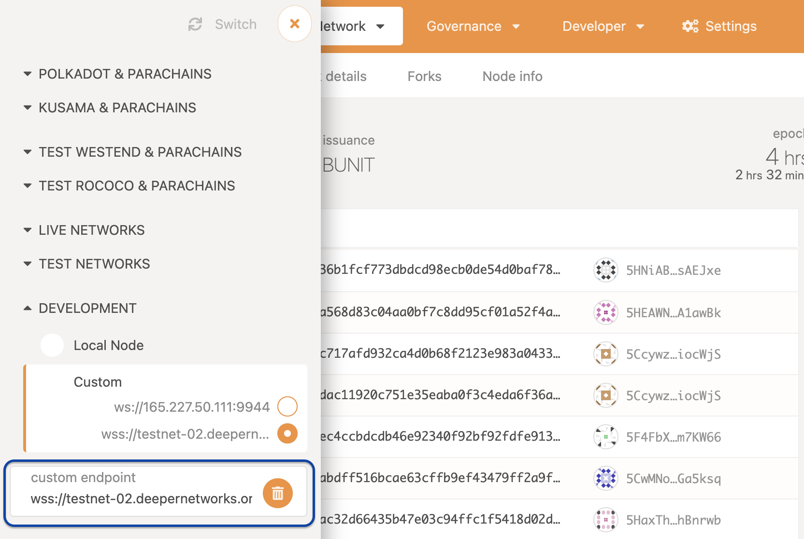
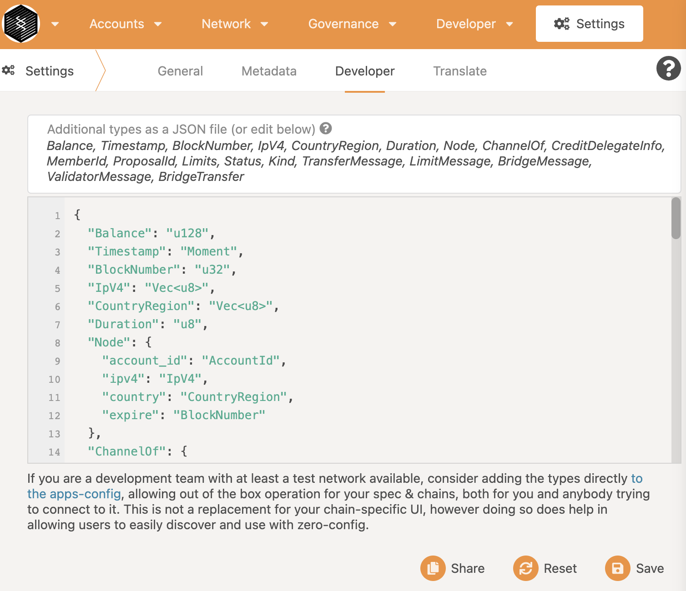

# Wallet Integration

## User

Since Deeper Chain is built on top of [Substrate](https://github.com/paritytech/substrate), [Polkadot JS extension](https://polkadot.js.org/extension/), which is a browser extension like Metamask, can be used to manage Deeper Chain accounts and sign transactions on Deeper Chain, and [Polkadot JS apps](https://polkadot.js.org/apps/) can be used to interact with Deeper Chain. You need to 

1. specify a custom endpoint, e.g., wss://testnet-02.deepernetworks.org in the Polkadot JS apps like below:



2. Add custom types in [this file](pallets/types.json) to the Settings like below:



## Developer

If you are a wallet developer, you only need to use the [Polkadot JS API library](https://polkadot.js.org/docs/).
When you create the `APIPromise` instance, you need to add the [custom types](pallets/types.json) to the config object like this:

```Javascript
// Import
import { ApiPromise, WsProvider } from '@polkadot/api';

...
// Construct
const wsProvider = new WsProvider('wss://testnet-02.deepernetworks.org');
const types = ... // TODO you need to set the custom types here
const api = await ApiPromise.create({ provider: wsProvider, types });

// Do something
console.log(api.genesisHash.toHex());
```